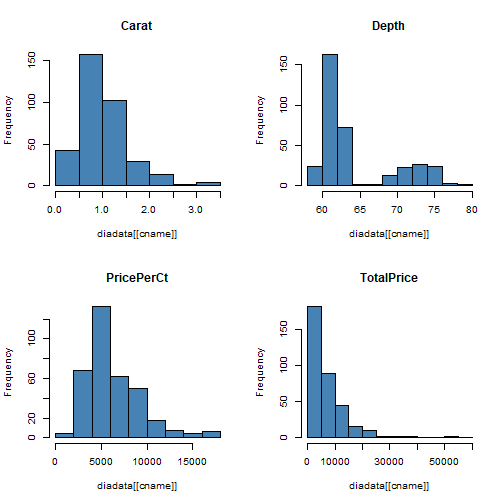

Presentation of Stat2data
========================================================
author: Huijin Yu 
date: 2021/3/03
autosize: true
font-import: https://fonts.googleapis.com/css2?family=Akaya+Kanadaka&display=swap
font-family: 'Akaya Kanadaka' 
css:custom.css

First Slide
========================================================
type: exclaim
incremental:true
For more details on Stat2data package presentations please visit [link](https://cran.r-project.org/web/packages/Stat2Data/index.html).

- Package:	Stat2Data
<li class="fragment fade-in " > Type:	Package </li>
<code>
- Version:	2.0.0
- Date:	2018-12-29
- License:	GPL-2
</code>
- LazyLoad:	yes

Description:
This package included datasets for both the first and second editions of the text.
Datasets for Stat2: Modeling with Regression and ANOVA (second edition) and Stat2: Building Models for a World of Data (first edition)


plots
========================================================
plots of Diamond dataset:
Price and characteristics for a sample of 351 diamonds



```
         Carat              Depth              PricePerCt        
breaks   Numeric,8          Integer,12         Numeric,10        
counts   Integer,7          Integer,11         Integer,9         
density  Numeric,7          Numeric,11         Numeric,9         
mids     Numeric,7          Numeric,11         Numeric,9         
xname    "diadata[[cname]]" "diadata[[cname]]" "diadata[[cname]]"
equidist TRUE               TRUE               TRUE              
         TotalPrice        
breaks   Numeric,13        
counts   Integer,12        
density  Numeric,12        
mids     Numeric,12        
xname    "diadata[[cname]]"
equidist TRUE              
```


summary of data
========================================================

Table: Data summary

|                         |         |
|:------------------------|:--------|
|Name                     |Diamonds |
|Number of rows           |351      |
|Number of columns        |6        |
|_______________________  |         |
|Column type frequency:   |         |
|factor                   |2        |
|numeric                  |4        |
|________________________ |         |
|Group variables          |None     |


**Variable type: factor**

|skim_variable | n_missing| complete_rate|ordered | n_unique|top_counts                          |
|:-------------|---------:|-------------:|:-------|--------:|:-----------------------------------|
|Color         |         0|             1|FALSE   |        7|F: 87, G: 86, E: 82, D: 52          |
|Clarity       |         0|             1|FALSE   |        8|VS1: 122, VS2: 93, SI1: 41, VVS: 35 |


**Variable type: numeric**

|skim_variable | n_missing| complete_rate|    mean|      sd|      p0|     p25|    p50|     p75|     p100|hist                                     |
|:-------------|---------:|-------------:|-------:|-------:|-------:|-------:|------:|-------:|--------:|:----------------------------------------|
|Carat         |         0|             1|    1.00|    0.49|    0.31|    0.70|    0.9|    1.24|     3.35|▇▅▁▁▁ |
|Depth         |         0|             1|   64.39|    5.13|   58.20|   61.20|   62.0|   68.55|    79.20|▇▁▁▂▁ |
|PricePerCt    |         0|             1| 6242.37| 2895.41| 1755.00| 4185.00| 5346.0| 7762.50| 17671.50|▇▆▃▁▁ |
|TotalPrice    |         0|             1| 7450.01| 7780.89|  544.10| 2832.75| 4762.8| 9340.90| 56454.40|▇▁▁▁▁ |


References
========================================================

From **RStudio support**:
- [Authoring R Presentations](https://support.rstudio.com/hc/en-us/articles/200486468)
- [Slide Transitions and Navigation](https://support.rstudio.com/hc/en-us/articles/200714013-Slide-Transitions-and-Navigation)
- [Customizing Fonts and Appearance](https://support.rstudio.com/hc/en-us/articles/200532307)
- [Displaying and Distributing Presentations](https://support.rstudio.com/hc/en-us/articles/200714023-Displaying-and-Distributing-Presentations)

Additional references:
- R Markdown [Reference Guide](https://www.rstudio.com/wp-content/uploads/2015/03/rmarkdown-reference.pdf)
- [Presentation Ninja](https://slides.yihui.name/xaringan) made using _xaringan_ package by Yihui Xie
